# Архитектура подпроекта vodec

## Содержание
1. [Детальная архитектура системы](#детальная-архитектура-системы)
2. [Алгоритмическая архитектура](#алгоритмическая-архитектура)
3. [Структуры данных и интерфейсы](#структуры-данных-и-интерфейсы)
4. [Архитектура экспорта данных](#архитектура-экспорта-данных)
5. [Конфигурационная архитектура](#конфигурационная-архитектура)
6. [Архитектура обработки ошибок](#архитектура-обработки-ошибок)
7. [Производительность и масштабируемость](#производительность-и-масштабируемость)
8. [Интеграционная архитектура](#интеграционная-архитектура)
9. [Архитектура тестирования](#архитектура-тестирования)
10. [Диаграммы и схемы](#диаграммы-и-схемы)

---

## 1. Детальная архитектура системы

### Общая архитектура компонентов

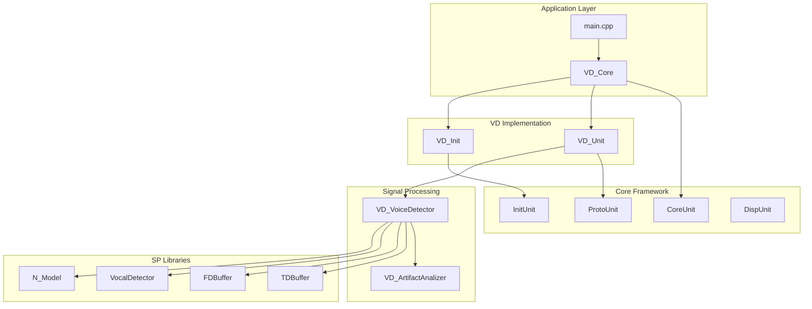

### Иерархия классов

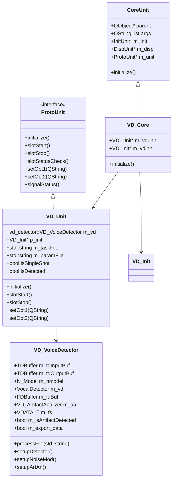

### Жизненный цикл обработки

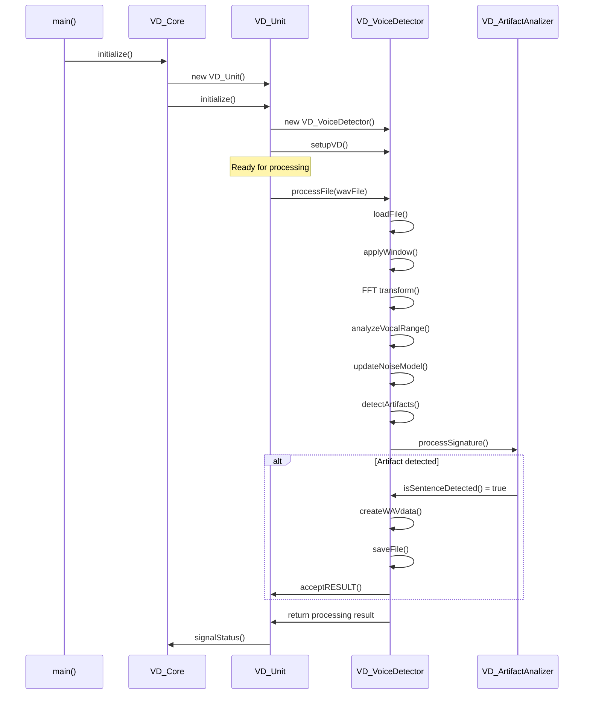

---

## 2. Алгоритмическая архитектура

### Поток обработки сигналов

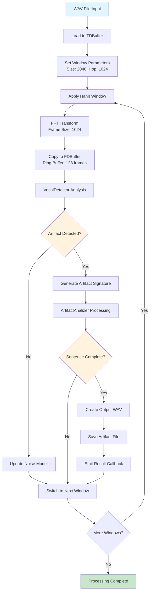

### Алгоритм детекции голоса

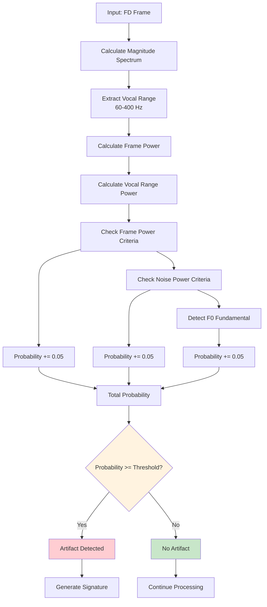

### Алгоритм анализа артефактов

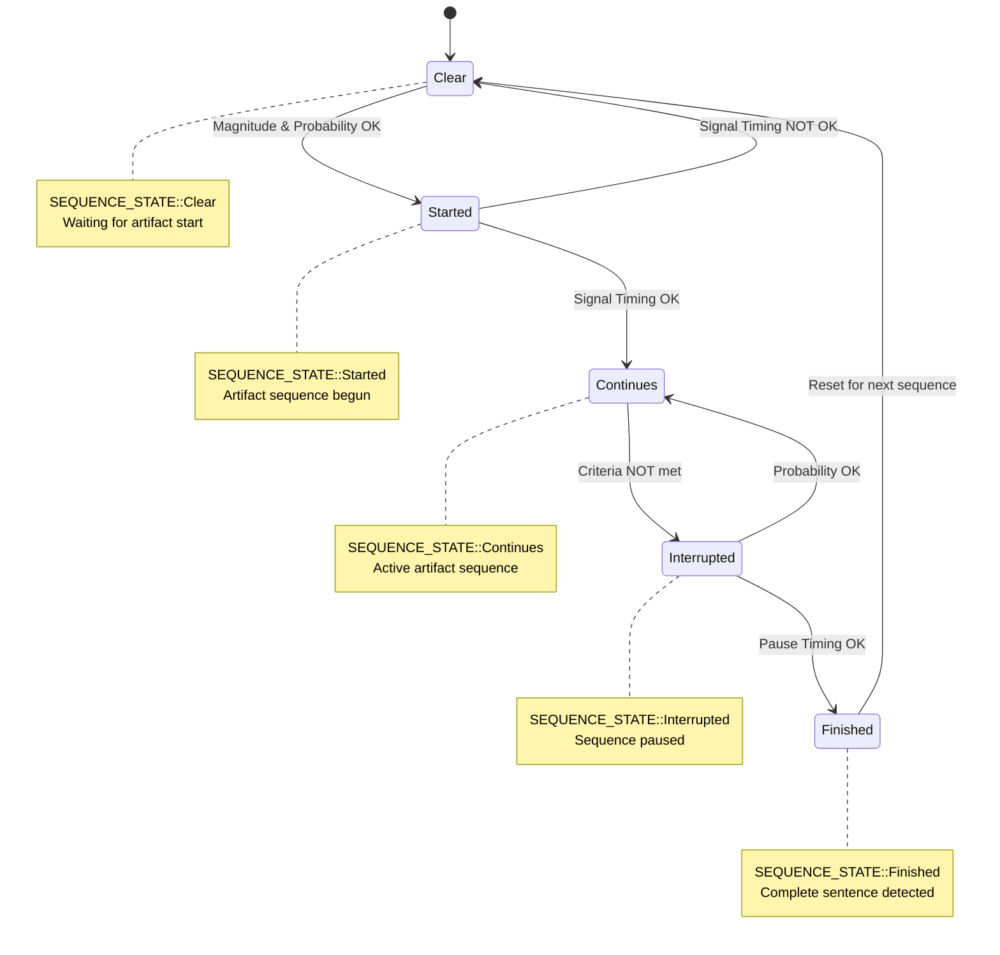

---

## 3. Структуры данных и интерфейсы

### Основные структуры данных

```cpp
// Структуры коэффициентов
struct VD_Coef_Frame {
    float VD_vocalRangeLoFreq;     // 60 Hz - нижняя граница голосового диапазона
    float VD_vocalRangeHiFreq;     // 400 Hz - верхняя граница голосового диапазона
    float VD_ProbabilityThreshold; // 0.3 - порог вероятности детекции
    float VD_powerThreshold;       // 0.15 - порог мощности сигнала
};

struct NM_Coef_Frame {
    float NM_scopeLength;            // 10.0 - длина области для модели шума
    float NM_weightRefreshThreshold; // 0.4 - порог обновления весов
    float NM_noiseMixinCoef;         // 0.01 - коэффициент смешивания шума
};

struct AA_Coef_Frame {
    unsigned AA_signalTimingThr; // 5 - порог времени сигнала (в кадрах)
    unsigned AA_pauseTimingThr;  // 10 - порог времени паузы (в кадрах)
    float AA_freqTol;            // 0.1 - толерантность частоты
};
```

### Структура подписи артефакта

```cpp
template<typename T, size_t FSize>
struct ArtifactSignature {
    long frameID;                              // ID кадра
    T probability;                             // Вероятность [0...1.0]
    T framePower;                              // Мощность кадра
    std::array<FrData<T>, FSize> signature;    // Частотные данные
};

template<typename T>
struct FrData {
    T freqHz;    // Частота в Гц
    T magn;      // Магнитуда
};
```

### Интерфейсы компонентов

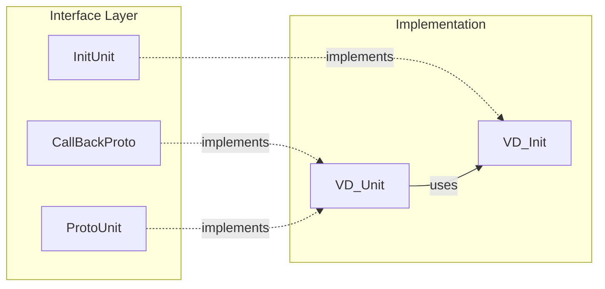

---

## 4. Архитектура экспорта данных

### Механизм экспорта

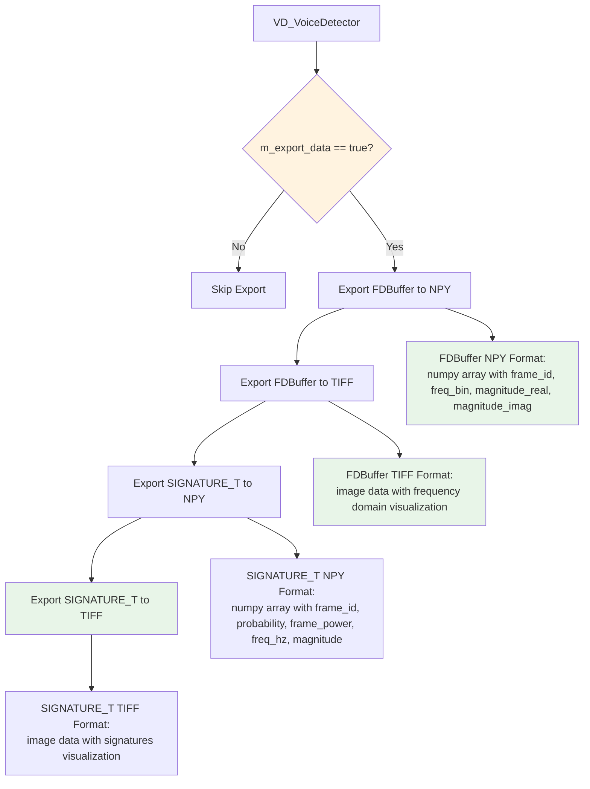

### Структура экспортируемых файлов

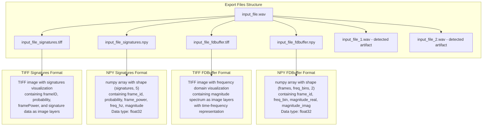

---

## 5. Конфигурационная архитектура

### Структура конфигурационного файла

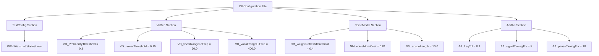

### Парсинг и валидация

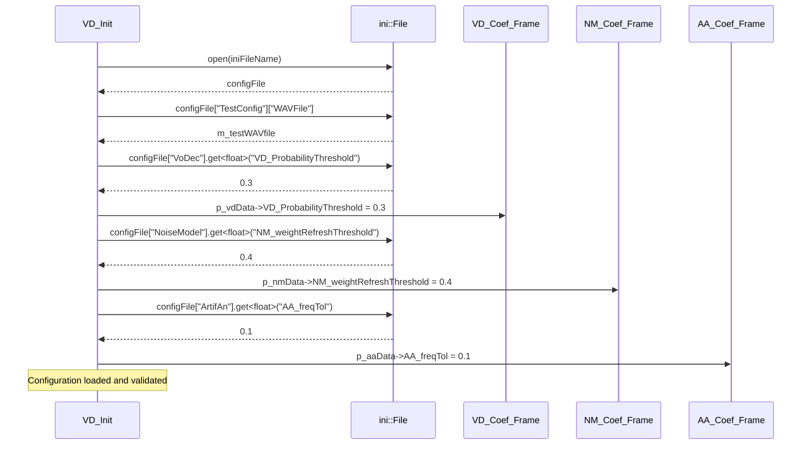

---

## 6. Архитектура обработки ошибок

### Иерархия обработки ошибок

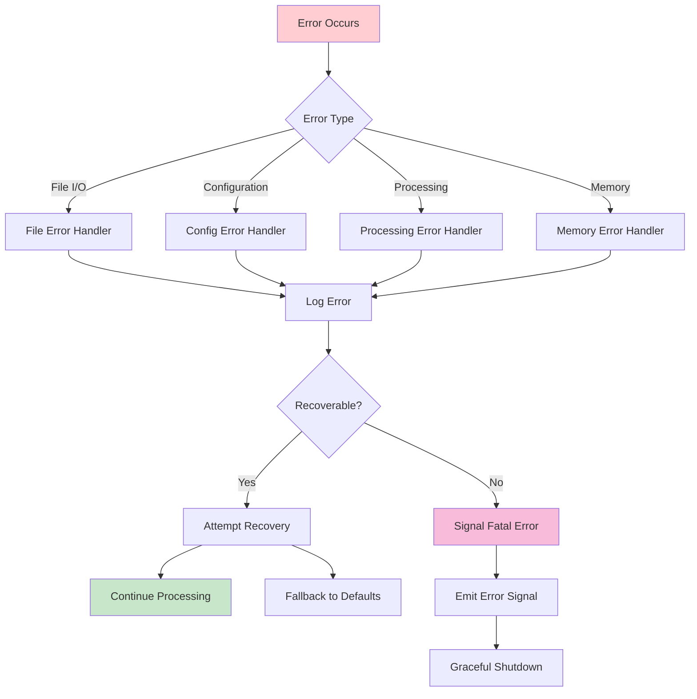

### Обработка ошибок по уровням

| Уровень | Тип ошибки | Обработка |
|---------|------------|-----------|
| **File I/O** | Не удается открыть WAV файл | Логирование, возврат false |
| **Configuration** | Неверный параметр в INI | Логирование, использование значения по умолчанию |
| **Processing** | Ошибка FFT | Логирование, пропуск кадра |
| **Memory** | Недостаточно памяти | Логирование, сигнал критической ошибки |

---

## 7. Производительность и масштабируемость

### Анализ узких мест

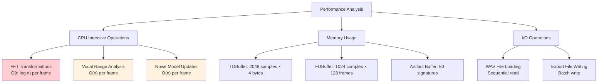

### Профиль производительности

| Операция | Время (мс) | Память (MB) | Оптимизация |
|----------|------------|-------------|-------------|
| **FFT Transform** | 0.5 | 0.008 | SIMD инструкции |
| **Vocal Detection** | 0.1 | 0.004 | Векторизация |
| **Noise Model** | 0.05 | 0.008 | Кэширование |
| **File I/O** | 10-100 | 0.5-5 | Асинхронный I/O |

---

## 8. Интеграционная архитектура

### Взаимодействие с BandMaster

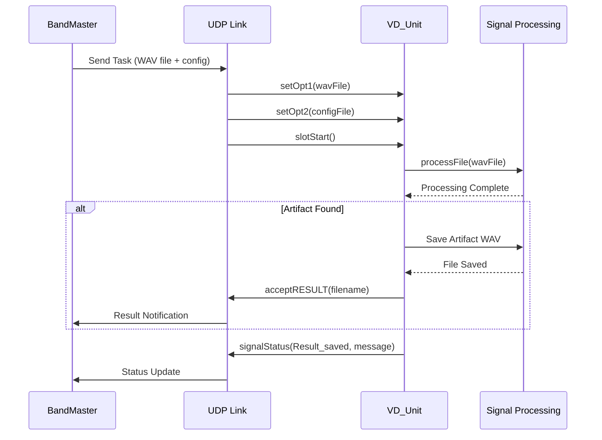

### UDP протокол

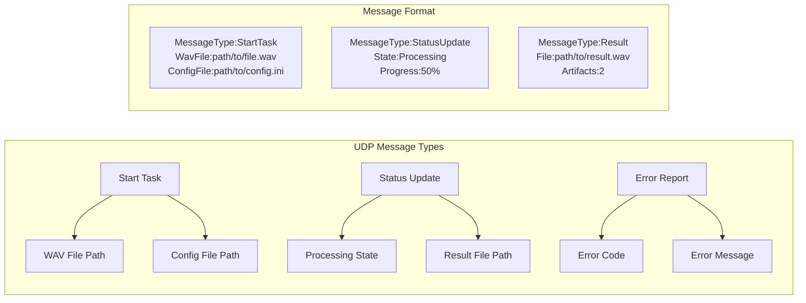

---

## 9. Архитектура тестирования

### Стратегия тестирования

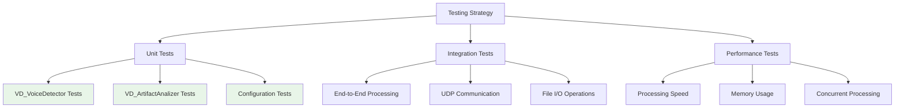

### Тестовые данные

| Тип теста | Входные данные | Ожидаемый результат |
|-----------|----------------|-------------------|
| **Clean Voice** | Чистый голосовой сигнал | 1 артефакт, высокая вероятность |
| **Noisy Voice** | Голос с шумом | 1 артефакт, средняя вероятность |
| **Music** | Музыкальный сигнал | 0 артефактов |
| **Silence** | Тишина | 0 артефактов |
| **Mixed** | Смешанный сигнал | Множественные артефакты |

---

## 10. Диаграммы и схемы

### UML диаграмма классов (детальная)

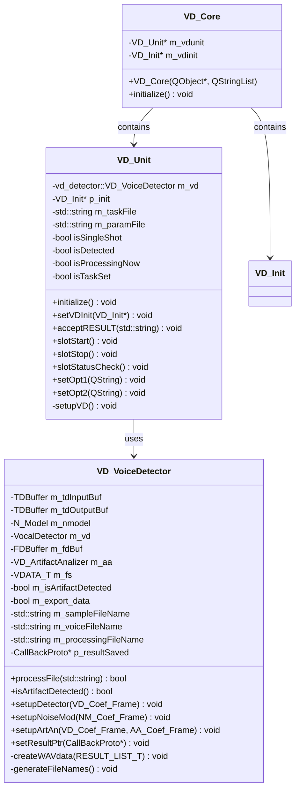

### Схема потоков данных

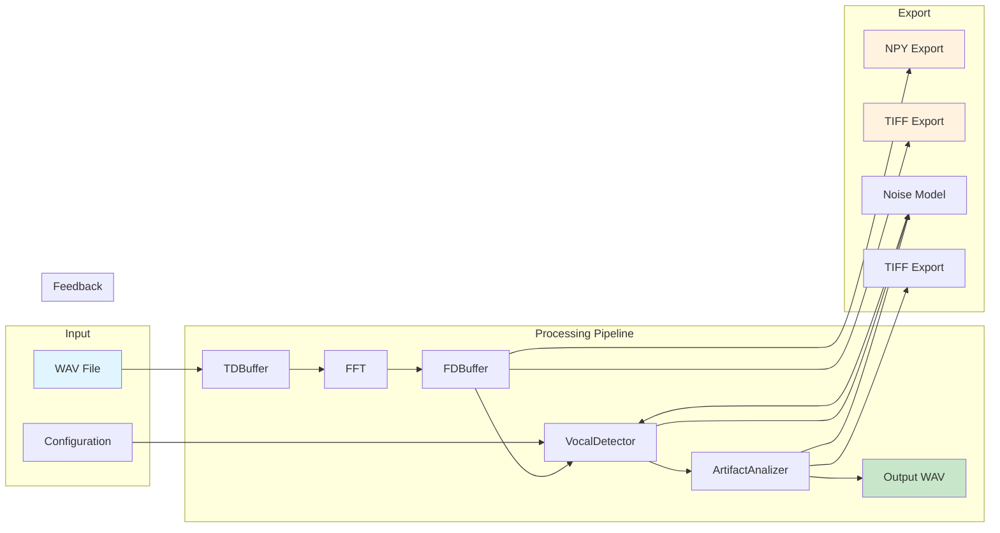

---

*Документ создан: [Дата]*
*Версия: 1.0*
*Автор: [Имя]*
